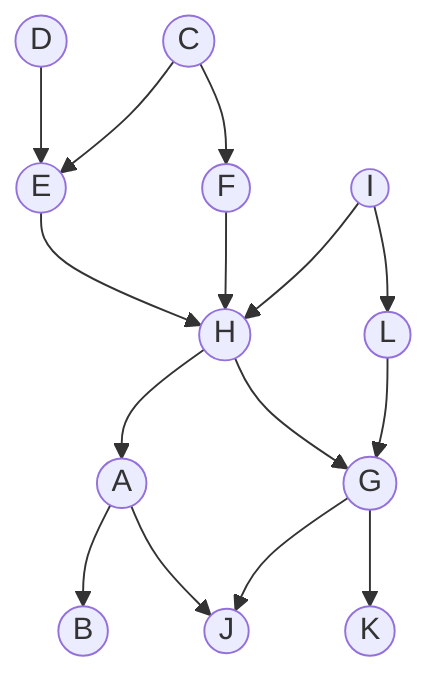
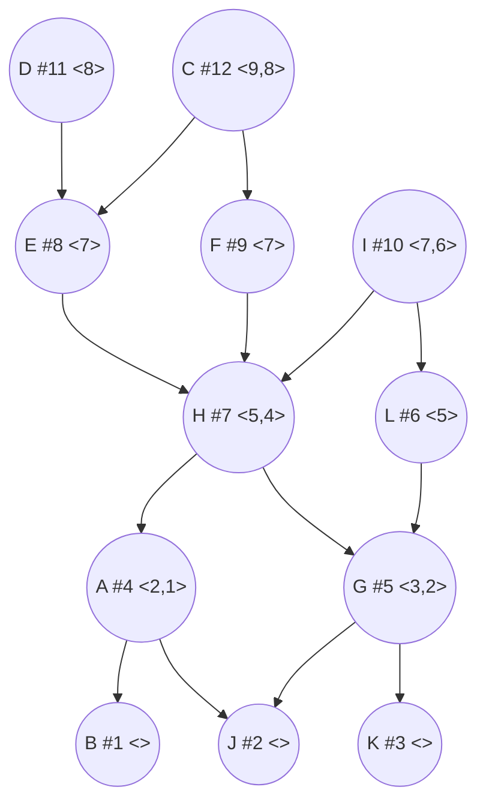

# Задание №11. Варианты 1-3
## Оптимальное расписание. Лексикографическая стратегия.

В зависимости от варианта реализовать один из классов:
- Вариант 1. Класс *GraphGenerator* в файле graphs/graph_generator.py,
- Вариант 2. Класс *GraphValidator* в файле graphs/graph_validator.py, 
- Вариант 3. Класс *LexicSchedule* в файле schedules/lexic_schedule.py.

## Примечания  
- Установить необходимые зависимости можно из файла requirements.txt с помощью команды `pip install -r requirements.txt`
- Разработку вести в отдельной ветке, созданной на основе данной. В названии ветки префикс main заменить на название команды.  
- Изменения в ветке должны быть только в файлах реализуемого класса и соответствующих тестов, различные конфигурационные файлы и кэш IDE фиксировать не нужно. 

## Постановка задачи:
1. количество заданий произвольно;`
2. все задания имеют одинаковую длительность;
3. задания зависимы, причём **граф зависимостей не должен содержать транзитивных ребер**;
4. запрещены прерывания при выполнении заданий;
5. количество **работников строго 2**;
6. работники универсальны;
7. производительность работников, размеры оплаты из труда и т.д. не учитываются;

*Требуется построить расписание выполнения всех заданий для заданного количества исполнителей в кратчайшие сроки.*

## Лексикографическая стратегия
Перед выполнением алгоритма необходимо удалить из графа зависимостей транзитивные ребра.

Для построения расписания необходимо назначить приоритет для каждой задачи. В первую очередь приоритеты 1, 2, 3, ... назначаются стокам графа (вершины, из которых нет исходящих ребер). 

Для заданий, все прямые потомки которых уже имеют приоритеты, составляется строка из приоритетов прямых потомков, записанных в убывающем порядке. Приоритет (t + 1) назначается заданию, у которого строка из приоритетов является лексикографически наименьшей.

После того как приоритеты для всех задач назначены, задачи добавляются в расписание в соответствии с их приоритетом. В каждый момент времени выбираются задачи готовые к выполнению (для которых все предшествующие задачи выполнены к началу момента времени) из них для добавления в расписание выбирается задача с наибольшим приоритетом.

### Таблица зависимостей

| Предшествующее задание | A | A | C | C | D | E | F | G | G | H | H | I | I | L |
|------------------------|---|---|---|---|---|---|---|---|---|---|---|---|---|---|
| Последующее задание    | B | J | E | F | E | H | H | J | K | A | G | H | L | G |

### Граф зависимостей

### Граф зависимостей с приоритетами
Приоритет - #
Строка приоритетов прямых потомков - <>

### Диаграмма Ганта

```mermaid
gantt
    title Диаграмма Ганта
    dateFormat HH:mm    
    axisFormat %H:%M
    Начало выполнения работ : milestone, m1, 00:00, 0h
    section Исполнитель 1
    C         :c, 00:00, 1h
    I         :i, after c, 1h    
    E         :e, after i, 1h    
    H         :h, after e, 1h
    A         :a, after h, 1h
    B         :b, after a, 1h
    K         :k, after b, 1h
    section Исполнитель 2
    D         :d, 00:00, 1h
    F         :f, after d, 1h
    L         :l, after f, 1h
    G         :g, after h, 1h
    J         :j, after g, 1h
    Окончание выполнения работ : milestone, m2, 07:00, 0h
```

