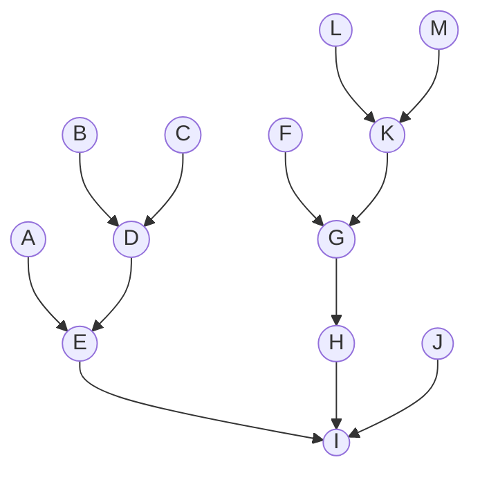
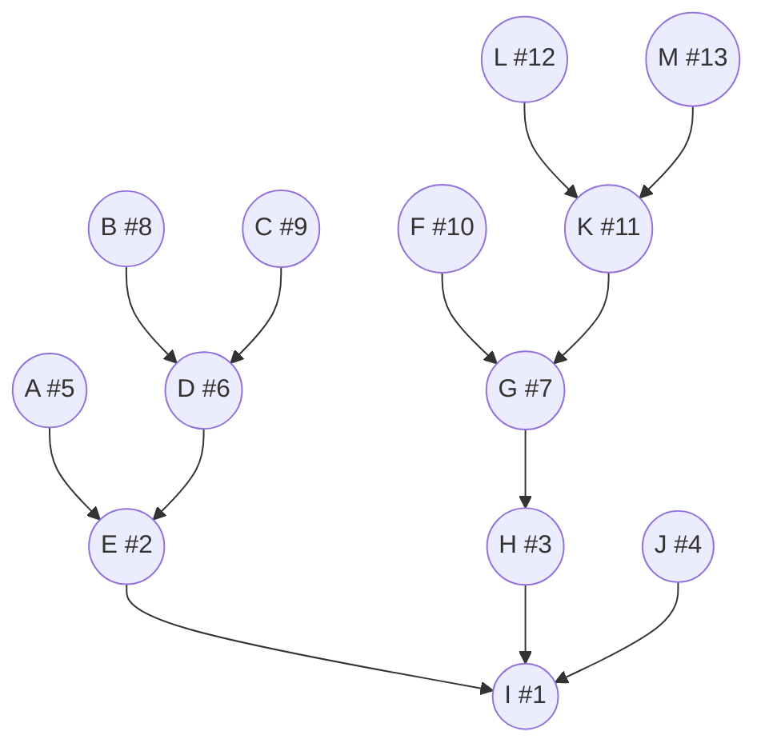

# Задание №11. Варианты 4-6
## Оптимальное расписание. Уровневая стратегия..

В зависимости от варианта реализовать один из классов:
- Вариант 4. Класс *GraphGenerator* в файле graphs/graph_generator.py,
- Вариант 5. Класс *GraphValidator* в файле graphs/graph_validator.py, 
- Вариант 6. Класс *LevelSchedule* в файле schedules/level_schedule.py.

## Примечания  
- Установить необходимые зависимости можно из файла requirements.txt с помощью команды `pip install -r requirements.txt`
- Разработку вести в отдельной ветке, созданной на основе данной. В названии ветки префикс main заменить на название команды.  
- Изменения в ветке должны быть только в файлах реализуемого класса и соответствующих тестов, различные конфигурационные файлы и кэш IDE фиксировать не нужно. 

## Уровневая стратегия
### Постановка задачи:
1. количество заданий произвольно;
2. все задания имеют одинаковую длительность;
3. задания зависимы, причём граф зависимостей имеет вид дерева, ориентированного к корню (или ориентированного леса);
4. запрещены прерывания при выполнении заданий;
5. количество работников произвольно;
6. работники универсальны;
7. производительность работников, размеры оплаты из труда и т.д. не учитываются;

*Требуется построить расписание выполнения всех заданий для заданного количества исполнителей в кратчайшие сроки.*
### Алгоритм решения задачи
Для построения расписания необходимо назначить приоритет для каждой задачи. В первую очередь приоритеты 1, 2, 3, ... назначаются стокам графа (вершины, из которых нет исходящих ребер). Если приоритеты 1, 2, 3, ..., t уже назначены, то приоритет (t + 1) назначается заданию, у которого прямой потомок имеет наименьший приоритет.

После того как приоритеты для всех задач назначены, задачи добавляются в расписание в соответствии с их приоритетом. В каждый момент времени выбираются задачи готовые к выполнению (для которых все предшествующие задачи выполнены к началу момента времени) из них для добавления в расписание выбирается задача с наибольшим приоритетом.

### 1.  Таблица зависимостей

| Предшествующее задание | A | B | C | D | E | F | G | H | J | K | L | M |
|------------------------|---|---|---|---|---|---|---|---|---|---|---|---|
| Последующее задание    | E | D | D | E | I | G | H | I | I | G | K | K |

### Граф зависимостей

###  2. Для решения используется уровневая стратегия, поэтому необходимо расставить приоритеты.
1. Приоритет 1 отдаем корню I
2. Претенденты для приоритета 2: E, H, J. Приоритет отдается тому у кого самый слабый потомок, так как потомки одинаковой силы, то приоритет 2 можно отдать E.
3. Претенденты для приоритета 3: H, J, A, D. Приоритет 3 отдаем H.
4. Претенденты для приоритета 4: J, A, D, G. Приоритет 4 отдаем J.
5. Претенденты для приоритета 5:  A, D, G. Приоритет 5 отдаем A.
6. Претенденты для приоритета 6:  D, G. Приоритет 6 отдаем D.
7. Претенденты для приоритета 7:  G, B, C. Приоритет 7 отдаем G.
8. Претенденты для приоритета 8:  B, C, F, K. Приоритет 8 отдаем B.
9. Претенденты для приоритета 9:  C, F, K. Приоритет 9 отдаем C.
10. Претенденты для приоритета 10:  F, K. Приоритет 10 отдаем F. 
11. Претенденты для приоритета 11:  K. Приоритет 11 отдаем K. 
12. Претенденты для приоритета 12:  L, M. Приоритет 12 отдаем L. 
13. Претенденты для приоритета 10:  M. Приоритет 13 отдаем M. 

###  3. Таким образом, получаем граф зависимостей с приоритетами.

###  4. Построим диаграмму Ганта
### Строим диаграмму Ганта для двух исполнителей, распределяя задачи исполнителям с наибольшим приоритетом в первую очередь.

```mermaid
gantt
    
    title Диаграмма Ганта
    dateFormat HH:mm    
    axisFormat %H:%M
    Начало выполнения работ : milestone, m1, 00:00, 0h
    section Исполнитель 1
    M(13)         :c, 00:00, 1h
    K(11)         :i, after c, 1h    
    C(9)         :e, after i, 1h    
    G(7)         :h, after e, 1h
    A(5)         :a, after h, 1h
    H(3)         :b, after a, 1h
    I(1)         :k, after b, 1h
    section Исполнитель 2
    L(12)         :d, 00:00, 1h
    F(10)         :f, after d, 1h
    B(8)         :l, after f, 1h
    D(6)         :g, after l, 1h
    J(4)         :j, after g, 1h
    E(2)         :x, after j, 1h
    -            :y, after x, 1h
    Окончание выполнения работ : milestone, m2, 07:00, 0h
```

###  Ответ:  кратчайшее расписание имеет длительность 7.