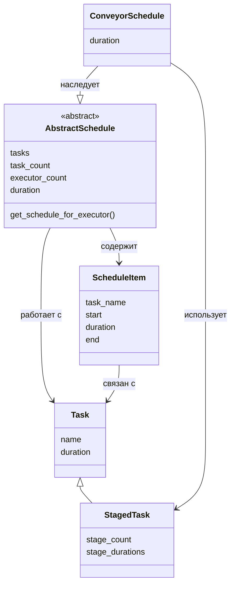

```mermaid
classDiagram

class Task {
  name
  duration
}

class StagedTask {
  stage_count
  stage_durations
}

Task <|-- StagedTask

class ScheduleItem {
  task_name
  start
  duration
  end
}

class AbstractSchedule {
  <<abstract>>
  tasks
  task_count
  executor_count
  duration
  get_schedule_for_executor()
}

class ConveyorSchedule {
  duration
}

AbstractSchedule --> Task : работает с
AbstractSchedule --> ScheduleItem : содержит
ConveyorSchedule --|> AbstractSchedule : наследует
ConveyorSchedule --> StagedTask : использует
ScheduleItem --> Task : связан с
```